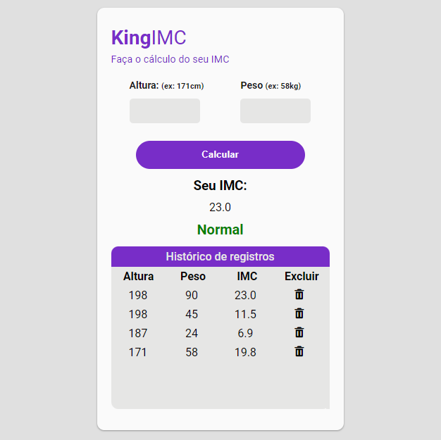

<h1>King Imc</h1>

<h2>Acesso via web: https://prado.kinghost.net/imc/index.php</h2>

<h3>Requisitos para executar o projeto:</h3>

- VSCode com a extensão PHP server instalada;
- Xampp.

<h3>Fazer a criação do banco de dados e da tabela que será utilizada:</h3>

Script para a criação das tabelas / Banco de dados: kingimc

CREATE TABLE registros (
  idregistros INTEGER UNSIGNED NOT NULL AUTO_INCREMENT,
  altura VARCHAR(25) NULL,
  peso VARCHAR(25) NULL,
  imc VARCHAR(25) NULL,
  PRIMARY KEY(idregistros)
);

Para executar o projeto basta abrir o arquivo index.php dentro do VSCode e utilizar a extensão PHP Sever clicando com o botão direito no código para executar.

<h3>Tela da aplicação</h3>

